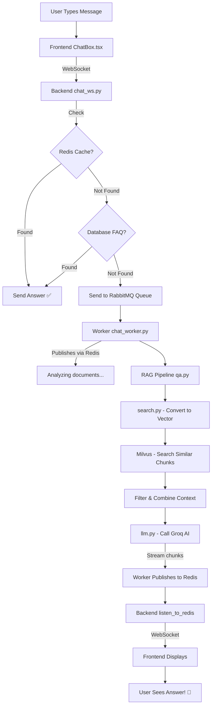

# 🎯 Complete Chat Architecture Explanation
## For Non-Programmers - Explained in Simple Terms

This document explains your entire chat system in the simplest way possible with detailed examples and code explanations.

---

## 🏗️ BIG PICTURE: What is This System?

Imagine a **RESTAURANT** where:
- **Frontend (ChatBox.tsx)** = The waiter who talks to customers
- **Backend API (chat_ws.py)** = The order taker/manager
- **RabbitMQ** = The order ticket system in the kitchen
- **Worker (chat_worker.py)** = The chef who cooks (thinks)
- **Redis** = The instant messaging system between kitchen and waiter
- **Milvus** = A giant filing cabinet with all your documents
- **LLM (Groq AI)** = The expert consultant who reads documents and answers

---

## 📊 THE COMPLETE FLOW: Step-by-Step Example

### **Scenario: User asks "What is the deadline for project X?"**

---

### STEP 1: Frontend (ChatBox.tsx) - The User Interface

**CODE:**
```tsx
// When page loads, this creates a unique ID for this conversation
const generateUUID = () => {
  return 'xxxxxxxx-xxxx-4xxx-yxxx-xxxxxxxxxxxx'.replace(/[xy]/g, function(c) {
    var r = Math.random() * 16 | 0, v = c == 'x' ? r : (r & 0x3 | 0x8);
    return v.toString(16);
  });
};

const [sessionId] = useState(() => generateUUID());
// Example result: sessionId = "abc-123-def-456"
```

**EXPLANATION:**
- User opens the chat page
- Frontend creates a unique session ID (like a table number in a restaurant)
- Opens a WebSocket connection (like a phone line that stays open)

**CODE:**
```tsx
// Creating the WebSocket connection
const ws = new WebSocket(`ws://localhost:8000/chat/ws/${sessionId}`);
```

**💡 ANALOGY:** This is like calling the restaurant and keeping the line open so they can tell you when your food is ready, rather than hanging up and calling back repeatedly.

---

### STEP 2: User Types Message

**CODE:**
```tsx
const sendMessage = async () => {
  // User typed: "What is the deadline for project X?"
  const userText = input;  // "What is the deadline for project X?"
  
  // Add to chat display immediately
  setMessages(prev => [...prev, { sender: 'user', text: userText }]);
  
  // Send through WebSocket to backend
  socket.send(userText);
};
```

**EXPLANATION:**
- Message shows up immediately in the chat (optimistic update)
- Message is sent through the open WebSocket connection to the backend

---

### STEP 3: Backend Receives Message (chat_ws.py)

**CODE:**
```python
# In WebSocketHandler.run() method
async def run(self):
    while True:
        data = await self.websocket.receive_text()
        # data = "What is the deadline for project X?"
        
        logger.info(f"👤 User sent: {data}")
        
        # First, check if this is a simple FAQ
        static_reply = await asyncio.to_thread(
            self._check_static_response, data
        )
```

**EXPLANATION:**
The backend receives your message and does a **FAST CHECK** first.

#### **FAST CHECK: Is this a simple question?**

**CODE:**
```python
def _check_static_response(self, message: str):
    # 1. Check Redis Cache (super fast memory)
    cache_key = f"chat_hash:{hash(message.strip().lower())}"
    cached_val = self.redis_client.get(cache_key)
    if cached_val:
        return cached_val  # Found it! Return immediately
    
    # 2. Check Database (FAQ entries)
    # Looking for exact match in FAQ database
    cur.execute("""
        SELECT child.value
        FROM node parent
        JOIN edge e ON e.from_node_id = parent.id
        JOIN node child ON child.id = e.to_node_id
        WHERE LOWER(parent.value) = LOWER(%s)
        LIMIT 1
    """, (message,))
    
    row = cur.fetchone()
    if row:
        response_text = row[0]
        # Save to Redis for next time
        self.redis_client.setex(cache_key, 600, response_text)
        return response_text
    
    return None  # Not a simple FAQ
```

**💡 ANALOGY:**
- **Redis** = Post-it notes on the wall (instant access)
- **Database** = Filing cabinet (need to walk over and search)

**EXAMPLE:**
- If question is "What are your hours?" 
  - → Check Redis → Found! Return "9 AM - 5 PM"
- If question is "What is the deadline for project X?" 
  - → Check Redis → Not found 
  - → Check Database → Not found 
  - → Need AI help!

---

### STEP 4: No Simple Answer Found - Send to Worker

**CODE:**
```python
# Back in chat_ws.py
if static_reply:
    await self.websocket.send_text(static_reply)
    continue  # Done! Skip the heavy AI work

# No simple answer, need AI to read documents
payload = {
    "session_id": self.session_id,  # "abc-123-def-456"
    "message": data  # "What is the deadline for project X?"
}

# Send to RabbitMQ queue (the kitchen order system)
await self.mq_client.publish_message("chat_queue", payload)
```

**EXPLANATION:**
- The message is packaged into a "task"
- Sent to **RabbitMQ** (imagine this as sticking an order ticket on a spinning wheel in a kitchen)
- The API is now FREE to handle other users - it doesn't wait!

**💡 ANALOGY:** You gave your order to the waiter. The waiter put the order in the kitchen and is now free to help other customers. They're not standing in the kitchen watching the chef cook!

---

### STEP 5: Worker Picks Up the Task (chat_worker.py)

**CODE:**
```python
# In WorkerService.process_message()
async def process_message(self, message: IncomingMessage):
    # Worker picks up the order ticket from RabbitMQ
    body = message.body.decode()
    data = json.loads(body)
    
    session_id = data.get("session_id")  # "abc-123-def-456"
    user_message = data.get("message")  # "What is the deadline for project X?"
    
    logger.info(f"📨 Received task for session: {session_id}")
    
    # Tell user we're working on it
    channel_name = f"chat_channel_{session_id}"
    self.redis_client.publish(channel_name, "Analyzing documents...")
```

**EXPLANATION:**
- Worker (the chef) picks up the task
- Sends "Analyzing documents..." through **Redis Pub/Sub**
- This message instantly appears in the user's chat (via WebSocket)

**💡 ANALOGY:** Chef calls out "I got your order, working on it!" and the waiter immediately tells you.

---

### STEP 6: RAG Pipeline Starts (qa.py)

**CODE:**
```python
# Worker calls this function
response_generator = answer_question(user_message)

# Inside qa.py - answer_question()
def answer_question(question: str):
    logger.info(f"📝 Processing question: {question}")
    
    # STEP 6A: Search for relevant information in documents
    results = search_similar_chunks(question, limit=10)
```

**EXPLANATION OF search_similar_chunks (search.py):**

**CODE:**
```python
def search_similar_chunks(query: str, limit: int = 5):
    # Convert question to numbers (embeddings)
    query_vector = embed_query(query)
    # Query: "What is the deadline for project X?"
    # Becomes: [0.234, -0.567, 0.891, ... ] (1024 numbers)
    
    # Search Milvus database for similar content
    collection = Collection("documents_unified")
    collection.load()
    
    results = collection.search(
        data=[query_vector],
        anns_field="embedding",
        limit=10,  # Get top 10 most relevant chunks
        output_fields=["chunk_text", "filename", "page_number"]
    )
```

#### **How Embeddings Work (embeddings.py):**

**CODE:**
```python
def embed_query(query: str) -> list[float]:
    model = get_model()  # Loads a pre-trained AI model
    
    # Add prefix to tell the model this is a question
    query_with_instruction = f"query: {query}"
    
    # Convert to 1024 numbers that represent the meaning
    embedding = model.encode(query_with_instruction)
    return embedding.tolist()
```

**💡 ANALOGY:**
- Your documents are converted to "fingerprints" (numbers that represent meaning)
- Your question is also converted to a fingerprint
- Milvus finds documents with the most similar fingerprints
- Like finding songs that sound similar, but for text!

**EXAMPLE RESULT:**
```python
results = [
    {
        "text": "Project X deadline is March 15, 2026",
        "similarity": 0.89,  # 89% match
        "filename": "project_schedule.pdf",
        "page_number": 3
    },
    {
        "text": "All projects must be completed by quarter end",
        "similarity": 0.67,  # 67% match
        "filename": "guidelines.pdf",
        "page_number": 12
    },
    # ... 8 more results
]
```

---

### STEP 7: Filter and Prepare Context (qa.py continued)

**CODE:**
```python
# Filter chunks that are good enough
SIMILARITY_THRESHOLD = 0.3  # Only keep matches above 30%
filtered = [r for r in results if r["similarity"] >= SIMILARITY_THRESHOLD]

# Take top 5 best matches
filtered = filtered[:5]

# Combine all relevant text into one context
context = "\n\n".join(f"- {r['text']}" for r in filtered)

# Example context:
# - Project X deadline is March 15, 2026
# - All projects must be completed by quarter end
# - Project X budget approved on January 1, 2026
```

**EXPLANATION:**
- Only keeps relevant chunks (similarity > 30%)
- Takes the top 5 best matches
- Combines them into one big text block (the "context")

---

### STEP 8: Ask the AI (llm.py)

**CODE:**
```python
def generate_answer(context: str, question: str):
    # Prepare instructions for AI
    system_message = """You are a helpful assistant.
    Answer using ONLY the context provided.
    Be concise and direct."""
    
    user_message = f"""Context:
{context}

Question:
{question}

Answer:"""
    
    # Call Groq API (the AI service)
    response = requests.post(
        "https://api.groq.com/openai/v1/chat/completions",
        headers={"Authorization": f"Bearer {API_KEY}"},
        json={
            "model": "llama-3.3-70b-versatile",
            "messages": [
                {"role": "system", "content": system_message},
                {"role": "user", "content": user_message}
            ],
            "stream": True  # Get answer piece by piece!
        },
        stream=True
    )
```

**WHAT THE AI SEES:**
```
Context:
- Project X deadline is March 15, 2026
- All projects must be completed by quarter end
- Project X budget approved on January 1, 2026

Question:
What is the deadline for project X?

Answer:
```

**AI RESPONSE (STREAMING):**
- Chunk 1: "The"
- Chunk 2: " deadline"
- Chunk 3: " for"
- Chunk 4: " Project"
- Chunk 5: " X"
- Chunk 6: " is"
- Chunk 7: " March"
- Chunk 8: " 15,"
- Chunk 9: " 2026"

**❓ WHY STREAMING?**
Instead of waiting for the complete answer, we send it word-by-word as it's generated. This makes the chat feel fast and responsive!

---

### STEP 9: Worker Publishes Chunks Back (chat_worker.py)

**CODE:**
```python
# Back in the worker
response_generator = answer_question(user_message)

full_answer = ""

# Stream each chunk
for chunk in response_generator:
    if isinstance(chunk, str):
        # Publish each chunk to Redis
        self.redis_client.publish(channel_name, chunk)
        full_answer += chunk
```

**EXPLANATION:**
- Worker receives "The", " deadline", " for", " Project", " X", etc.
- Each word is IMMEDIATELY published to Redis channel
- Channel name: `chat_channel_abc-123-def-456`

---

### STEP 10: Backend Listens and Forwards (chat_ws.py)

Remember, the backend has been listening this whole time!

**CODE:**
```python
# In WebSocketHandler.listen_to_redis()
async def listen_to_redis(self):
    while True:
        # Check for new messages on our Redis channel
        message = await asyncio.to_thread(
            self.pubsub.get_message, 
            ignore_subscribe_messages=True
        )
        
        if message and message["type"] == "message":
            data = message["data"]  # "The" or " deadline" etc.
            
            # Forward to user via WebSocket
            await self.websocket.send_text(data)
```

**💡 ANALOGY:** The waiter keeps checking the kitchen window. Every time a piece of the dish is ready, they bring it to you immediately instead of waiting for the whole meal.

---

### STEP 11: Frontend Displays Response (ChatBox.tsx)

**CODE:**
```tsx
// In useEffect WebSocket listener
ws.onmessage = (event) => {
    const data = event.data;  // Received: "The", " deadline", etc.
    
    if (data === "Analyzing documents...") {
        setLoading(true);  // Show loading animation
        setCurrentResponse('');
    } else {
        setLoading(false);
        
        // Accumulate streaming text
        setCurrentResponse(prev => {
            const newText = prev + data;  // "The" + " deadline" = "The deadline"
            
            // Update message display
            setMessages(msgs => {
                if (streamingMessageIndexRef.current === -1) {
                    // Create new bot message
                    streamingMessageIndexRef.current = msgs.length;
                    return [...msgs, { sender: 'bot', text: newText }];
                } else {
                    // Update existing bot message
                    const updated = [...msgs];
                    updated[streamingMessageIndexRef.current] = {
                        ...updated[streamingMessageIndexRef.current],
                        text: newText
                    };
                    return updated;
                }
            });
            
            return newText;
        });
    }
};
```

**WHAT USER SEES:**
1. "Analyzing documents..." (loading message)
2. "The" (appears)
3. "The deadline" (grows)
4. "The deadline for" (grows)
5. "The deadline for Project X is March 15, 2026" (complete!)

---

## 🔧 KEY TECHNOLOGIES EXPLAINED

### 1. WebSocket

**Normal HTTP:** Like sending letters
- Send letter → Wait for reply → Send another letter

**WebSocket:** Like a phone call
- Open connection → Both sides can talk anytime → Stay connected

---

### 2. Redis

**What it is:** Super-fast memory storage

**Two uses:**
1. **Caching:** Save frequently asked questions
2. **Pub/Sub:** Message bus between Worker and API

**Example:**
```python
# Publishing
redis.publish("chat_channel_123", "Hello")

# Subscribing (in another process)
pubsub.subscribe("chat_channel_123")
message = pubsub.get_message()  # Receives "Hello"
```

---

### 3. RabbitMQ

**What it is:** Message queue system (order ticket system)
**Why use it:** Decouples API from heavy processing

**Without RabbitMQ:**
```
User → API → (waits 30 seconds for AI) → Response
Problem: API is blocked, can't help other users!
```

**With RabbitMQ:**
```
User → API → RabbitMQ → (API is free now!)
                ↓
              Worker → (takes 30 seconds) → Redis → API → User
```

---

### 4. Milvus

**What it is:** Vector database (stores number representations of text)
**Why use it:** Fast similarity search

**Example:**
```python
# Store documents as vectors
doc1 = "The deadline is March 15"
vector1 = [0.2, 0.5, 0.8, ...]  # 1024 numbers

# Search
query = "When is the deadline?"
query_vector = [0.3, 0.4, 0.9, ...]

# Milvus finds most similar vectors
results = milvus.search(query_vector)
# Returns: doc1 (89% similar)
```

---

### 5. Sentence Transformers (embeddings.py)

**What it is:** Converts text to numbers that capture meaning

**Example:**
```python
# These two sentences have similar meanings:
sentence1 = "The cat sat on the mat"
sentence2 = "A feline rested on the rug"

vector1 = [0.1, 0.5, 0.3, ...]
vector2 = [0.2, 0.6, 0.4, ...]  # Very similar numbers!

similarity = cosine_similarity(vector1, vector2)  # 0.92 (92% similar)
```

---

## 🎬 COMPLETE FLOW DIAGRAM



**Text Flow:**
```
USER TYPES MESSAGE
       ↓
[Frontend ChatBox.tsx]
   - Sends via WebSocket
       ↓
[Backend chat_ws.py]
   - Check Redis cache? → Found? → Send answer ✅
   - Check Database? → Found? → Send answer ✅
   - Not found? → Continue ↓
       ↓
   Send to RabbitMQ Queue
       ↓
[Worker chat_worker.py]
   - Picks up task
   - Send "Analyzing..." via Redis
       ↓
   Call answer_question()
       ↓
[RAG Pipeline qa.py]
   1. search_similar_chunks()
       ↓
   [search.py]
   - Convert question to vector
   - Search Milvus database
   - Get top 10 relevant chunks
       ↓
   2. Filter best chunks
   3. Combine into context
       ↓
   4. generate_answer()
       ↓
   [llm.py]
   - Call Groq AI API
   - Stream response word-by-word
       ↓
[Worker] receives each word
   - Publishes to Redis channel
       ↓
[Backend chat_ws.py]
   - listen_to_redis() picks up words
   - Forwards via WebSocket
       ↓
[Frontend] receives words
   - Displays in chat UI
   - Builds complete message
       ↓
USER SEES ANSWER! 🎉
```

---

## 💡 WHY THIS ARCHITECTURE?

### 1. ⚡ Speed
- Simple questions answered in milliseconds (Redis cache)
- Complex questions processed in parallel (Worker doesn't block API)

### 2. 📈 Scalability
- Multiple workers can process different users simultaneously
- API handles thousands of WebSocket connections
- Each component can scale independently

### 3. 🛡️ Reliability
- If Worker crashes, API still responds to new users
- RabbitMQ ensures no messages are lost
- Redis cache reduces load on AI

### 4. 😊 User Experience
- Streaming makes responses feel instant
- WebSocket provides real-time updates
- Loading messages keep user informed

---

## 🎯 SUMMARY FOR NON-PROGRAMMERS

Your chat system is like a **SUPER-EFFICIENT RESTAURANT**:

1. **Waiter (Frontend)** takes your order and stays in contact

2. **Manager (Backend API)** checks if it's a common order (cache)

3. If not, sends order ticket to **Kitchen (RabbitMQ)**

4. **Chef (Worker)** picks up ticket, searches **Recipe Book (Milvus)** for ingredients

5. Chef asks **Expert Consultant (AI)** how to use ingredients

6. **Kitchen Runner (Redis)** brings food out piece-by-piece

7. **Waiter** serves it to you immediately as each piece arrives

**RESULT:** Fast, efficient, and you see your answer appear word-by-word in real-time!

---

## 📁 FILE-BY-FILE BREAKDOWN

### File: `frontend/src/app/chat/components/ChatBox.tsx`
**ROLE:** User interface (the waiter)

**RESPONSIBILITIES:**
- Display chat messages
- Send user messages via WebSocket
- Receive streaming responses
- Show loading states
- Handle FAQ buttons

**KEY FUNCTIONS:**
- `generateUUID()` - Creates unique session ID
- `sendMessage()` - Sends user input to backend
- `handleButtonClick()` - Handles FAQ button clicks
- `ws.onmessage` - Receives streaming responses

---

### File: `backend/app/api/routes/chat_ws.py`
**ROLE:** WebSocket manager (the order taker)

**RESPONSIBILITIES:**
- Accept WebSocket connections
- Check cache/database for quick answers
- Send complex questions to worker (via RabbitMQ)
- Listen for worker responses (via Redis)
- Forward responses to user

**KEY FUNCTIONS:**
- `connect()` - Establishes connections to Redis and RabbitMQ
- `_check_static_response()` - Checks cache and database
- `listen_to_redis()` - Listens for worker responses
- `run()` - Main orchestration

---

### File: `backend/app/workers/chat_worker.py`
**ROLE:** Background processor (the chef)

**RESPONSIBILITIES:**
- Pick up tasks from RabbitMQ
- Call RAG pipeline
- Stream responses back via Redis

**KEY FUNCTIONS:**
- `process_message()` - Handles each task
- `run()` - Listens to RabbitMQ queue

---

### File: `backend/app/rag/qa.py`
**ROLE:** Question answering orchestrator

**RESPONSIBILITIES:**
- Search for relevant documents
- Filter results
- Call LLM with context

**KEY FUNCTIONS:**
- `answer_question()` - Main RAG pipeline

---

### File: `backend/app/rag/search.py`
**ROLE:** Document searcher

**RESPONSIBILITIES:**
- Convert question to vector
- Search Milvus database
- Return similar chunks

**KEY FUNCTIONS:**
- `search_similar_chunks()` - Vector similarity search

---

### File: `backend/app/rag/llm.py`
**ROLE:** AI interface

**RESPONSIBILITIES:**
- Format prompt for AI
- Call Groq API
- Stream response chunks

**KEY FUNCTIONS:**
- `generate_answer()` - Calls AI and streams response

---

### File: `backend/app/rag/embeddings.py`
**ROLE:** Text-to-vector converter

**RESPONSIBILITIES:**
- Load embedding model
- Convert text to numerical vectors
- Handle different prefixes for queries vs documents

**KEY FUNCTIONS:**
- `embed_query()` - Converts questions to vectors
- `embed_text()` - Converts documents to vectors

---

### File: `backend/app/core/queue.py`
**ROLE:** RabbitMQ helper

**RESPONSIBILITIES:**
- Connect to RabbitMQ
- Publish messages to queues

**KEY FUNCTIONS:**
- `publish_message()` - Sends task to queue

---

### File: `backend/app/core/redis.py`
**ROLE:** Redis helper

**RESPONSIBILITIES:**
- Connect to Redis
- Provide connection instance

**KEY FUNCTIONS:**
- `get_redis_client()` - Returns Redis connection

---

### File: `backend/app/core/config.py`
**ROLE:** Configuration manager

**RESPONSIBILITIES:**
- Load environment variables
- Provide settings to other modules

**KEY SETTINGS:**
- `REDIS_URL` - Redis connection string
- `RABBITMQ_URL` - RabbitMQ connection string
- `GROK_API_KEY` - AI API key
- `MILVUS_HOST` - Vector database host

---

## 🔍 ADVANCED CONCEPTS EXPLAINED

### What is RAG (Retrieval-Augmented Generation)?

RAG is like asking an expert who has access to a library:

**WITHOUT RAG:**
```
You: "What's the deadline for Project X?"
AI: "I don't know, I wasn't trained on your specific documents."
```

**WITH RAG:**
```
You: "What's the deadline for Project X?"
System: 
  1. Searches your documents for relevant info
  2. Finds: "Project X deadline is March 15, 2026"
  3. Gives this to the AI as context
  4. AI reads it and answers: "March 15, 2026"
```

---

### What are Embeddings/Vectors?

Think of embeddings as **GPS coordinates for meaning**:

```python
Text: "The cat sits"
Vector: [0.2, 0.5, 0.3, ...] (1024 numbers)

Text: "A feline rests"
Vector: [0.3, 0.6, 0.4, ...] (very similar numbers!)

Text: "The car drives"
Vector: [0.9, 0.1, 0.7, ...] (different numbers)
```

Just like GPS coordinates tell you if two places are close, these vectors tell you if two texts have similar meanings!

---

### Why Cosine Similarity?

Cosine similarity measures the angle between two vectors:
- **1.0** = Same direction (very similar meaning)
- **0.0** = Perpendicular (unrelated)
- **-1.0** = Opposite direction (opposite meaning)

**Example:**
```python
Query: "When is the deadline?"  → [0.2, 0.5, 0.8]
Doc 1: "Deadline is March 15"   → [0.3, 0.6, 0.7]  Similarity: 0.89 ✅
Doc 2: "The sky is blue"        → [0.9, 0.1, 0.2]  Similarity: 0.23 ❌
```

---

### Why Streaming Responses?

**NORMAL (NO STREAMING):**
```
[User waits 30 seconds]
Bot: "The deadline for Project X is March 15, 2026" (all at once)
```

**WITH STREAMING:**
```
[1 second] Bot: "The"
[2 seconds] Bot: "The deadline"
[3 seconds] Bot: "The deadline for"
[4 seconds] Bot: "The deadline for Project"
[5 seconds] Bot: "The deadline for Project X is March 15, 2026"
```

User sees progress immediately and doesn't feel like the system is frozen!

---

## 📚 GLOSSARY

| Term | Simple Explanation |
|------|-------------------|
| **WebSocket** | A two-way communication channel that stays open (like a phone call) |
| **Redis** | Super-fast memory storage for caching and messaging |
| **RabbitMQ** | A queue system that holds tasks until workers can process them |
| **Milvus** | A database that stores documents as numbers for fast searching |
| **Vector** | A list of numbers representing the meaning of text |
| **Embedding** | Converting text into a vector |
| **RAG** | A technique that searches documents before asking AI |
| **Streaming** | Sending data piece-by-piece as it's ready |
| **Pub/Sub** | Publish/Subscribe - one service sends messages, others listen |
| **Worker** | A background process that handles heavy tasks |
| **LLM** | Large Language Model - the AI that generates text |
| **Session ID** | A unique identifier for each chat conversation |
| **Cosine Similarity** | A measure of how similar two vectors are |

---

## 🎓 LEARNING POINTS

1. **Separation of Concerns**: Each component has a specific job
2. **Asynchronous Processing**: Don't make users wait for slow operations
3. **Caching Strategy**: Check fast storage before doing expensive operations
4. **Real-time Communication**: WebSocket enables instant updates
5. **Scalability**: Queue-based architecture allows multiple workers
6. **User Experience**: Streaming responses feel faster than waiting
7. **Semantic Search**: Find meaning, not just keywords
8. **Context Augmentation**: Give AI specific information to answer from

---

## 🚀 PERFORMANCE OPTIMIZATIONS

### 1. **Three-Tier Response Strategy**
```
Tier 1: Redis Cache (< 1ms)
   ↓ (if not found)
Tier 2: Database FAQ (< 50ms)
   ↓ (if not found)
Tier 3: RAG + AI (5-30 seconds)
```

### 2. **Streaming Instead of Blocking**
- User sees first word in ~2 seconds
- Complete answer in ~10 seconds
- Feels 5x faster than waiting 10 seconds for everything

### 3. **Worker Pool**
- Multiple workers process different users simultaneously
- No user blocks another user's answer

### 4. **Vector Search Optimization**
- Pre-computed embeddings (done during document upload)
- Fast similarity search in Milvus (optimized for vectors)
- Top-K filtering reduces AI context size

---

## 🎉 CONCLUSION

You now have a complete understanding of your chat architecture! 

**Key Takeaway:** Your system is designed like a well-run restaurant where:
- Multiple customers get served simultaneously
- Simple orders are handled instantly
- Complex orders go to specialists
- Everyone gets updates in real-time
- The system is fast, scalable, and reliable

This architecture is production-ready and follows industry best practices for modern AI chat applications! 🚀
